# michael_kim_overview
Overview of all projects by Michael Kim (kimm58) for the dissertation, "Efficient Large Scale Informatics for Diffusion Magnetic Resonance Imaging in Alzheimer's Disease"

## 1.) An Empirical Assessment of the Assumptions of ComBat with Diffusion Tensor Imaging

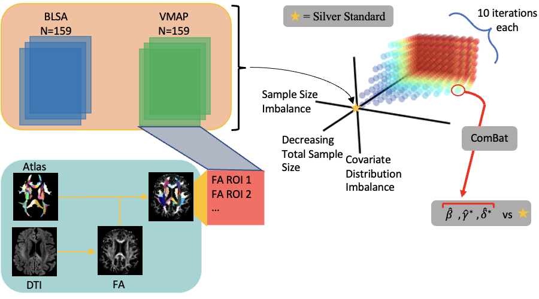

Github: https://github.com/MASILab/Diff_MRI_Harmonization.git

Data: backup via amazon (ADSP)

Paper: https://www.spiedigitallibrary.org/journals/journal-of-medical-imaging/volume-11/issue-02/024011/Empirical-assessment-of-the-assumptions-of-ComBat-with-diffusion-tensor/10.1117/1.JMI.11.2.024011.full

This was my first research project, looking at performance of the ComBat algorithm for site-wise harmonization when using Diffusion MRI data. We assessed performance using a well-matched dataset from two different sites (VMAP, BLSA) as a baseline, then performed a bootstap analysis of how varying sample size, sample size imbalance, and covariate shift/overlap affect the estimates of association of Age with fractional anisotropy (FA) and mean diffusivity (MD), and the site-estimated shift and scale of the harmonized features (which were the FA/MD of regions in the EVE3 WMAtlas). Our analyses demonstated that ComBat performance is worse than expected for diffusion MRI data (i.e. need a larger sample size and tighter covariate overlap) in order to get estimates from ComBat that do not deviate too far from the well-matched scenario. 

Signed: Gaurav Rudravaram, June 11 2026

## 2.) Characterizing Low-cost Registration for Photographic Images to Computed Tomography

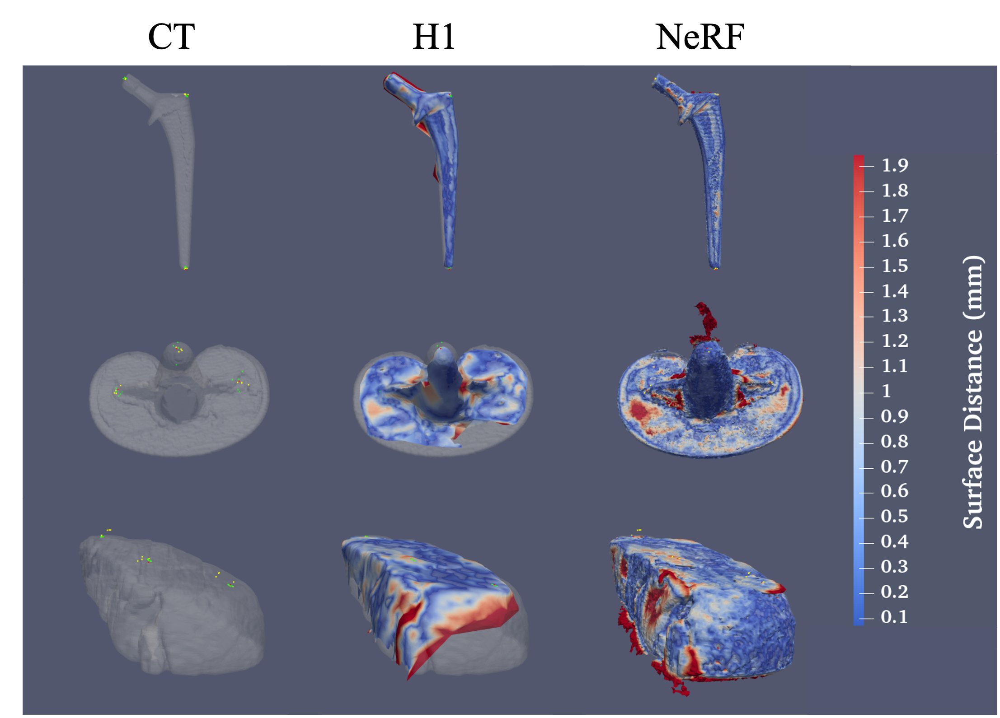

Github: https://github.com/MASILab/DeformableSurfaceReg.git

Data: XNAT: NeRF_Surface_Landman: https://xnat.vanderbilt.edu/xnat/data/projects/NeRF_Surface_Landman

Paper: https://medicalimaging.spiedigitallibrary.org/proceedings/Download?urlId=10.1117%2F12.3005578&downloadType=proceedings%20article&isResultClick=True
https://www.biorxiv.org/content/10.1101/2023.09.22.558989v1

SPIE 2024 paper - A characterization of low-cost photogrammetry techniques for surface reconstruction. Using surfaces obtained from CT images as the ground truth, we assess the quality of the photogrammetry surfaces obtained from Neural Radiance Fields (NeRF, as instant-ngp implementation) and the VECTRA H1 3D Imaging System of a hip implant, a knee implant, and a steak.  First, we register the photogrammetry surfaces to the ground truth CT. We then use fiducial registration error and average surface distance as metrics to assess quality. We find that the H1 camera provides smooth surfaces, but cannot reconstruct objects that are larger or have sharp changes in geometry. Whereas NeRF has the capability to capture finer detail, the surfaces are much noisier and more artifact-prone. Our conclusion was that NeRF-based methods have the greater potential, but improvements need to be made to the implementation.

## 3.) Characterization of Neural Radiance Field-Based 3D Reconstruction of Organ Tissue Surfaces (technical paper)

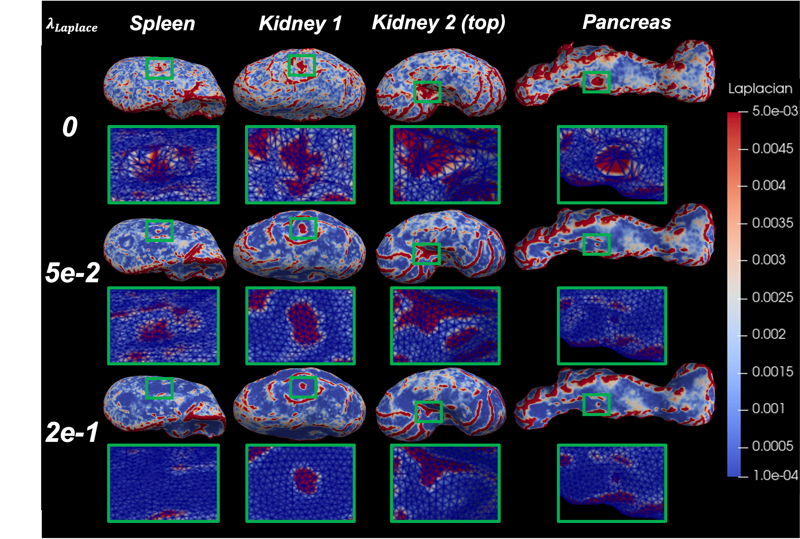

Github: https://github.com/MASILab/DeformableSurfaceReg.git

Data: XNAT: NeRF_Surface_Landman: https://xnat.vanderbilt.edu/xnat/data/projects/NeRF_Surface_Landman

Extension of SPIE 2024 - Characterization of NeRF-based techniques for reconstruction of human organ tissue surfaces. We assess multiple points in the processing pipeline (image acquisition and surface reconstruction) to determine what aspects of organ surfaces make reconstruction difficult and what solutions work best to optimize surface reconvery. We find that addition of external features in the image scene help with feature matching of the images, particularly when only adding a few eternal fiducials. We also find that modification of the specular estimator of the nerf2mesh implementation did not provide better surface recovery. However, having a high laplacian regularization helps remove/alleviate areas of low-density estimation. Building a shape model to fix the estimated density field also did not provide a successful solution.

## 4.) Scalable, reproducible, and cost-effective processing of large-scale medical imaging datasets

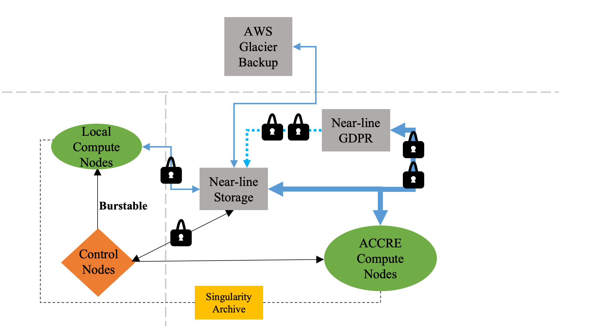

Github: https://github.com/MASILab/Informatics_ADSP.git

Data: Used MASIVar (timing data is in repo as well)

Paper: https://pubmed.ncbi.nlm.nih.gov/41450588/

SPIE 2025 - This paper is an overview paper for the ADSP processing methodology, descibing how we designed our data storage and processing to fit within specified design criteria of large-scale neuroimaging data maintenance. The criteria include (but are not limited to) efficiency, cost-effectiveness, and reproducibility. We demonstrate how our method performs similarly to other options while maintaining a nearly 20x lower cost-performance ratio, while remaining low complexity on our end for manual effort.

Signed: Gaurav Rudravaram, June 11 2026

## 5.) Scalable quality control on processing of large diffusion-weighted and structural magnetic resonance imaging datasets

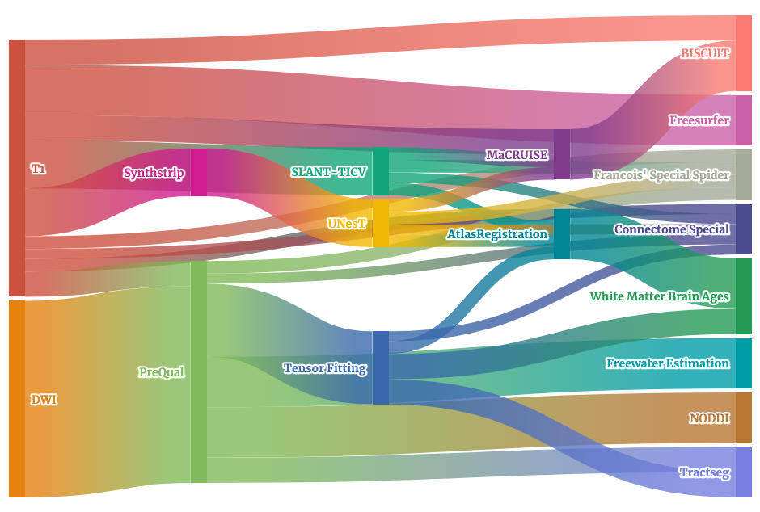

Github: https://github.com/MASILab/ADSP_AutoQA.git; (New version being maintained by Yihao: https://github.com/MASILab/masi-qa)

Paper: https://journals.plos.org/plosone/article?id=10.1371/journal.pone.0327388

PNG generation code: https://github.com/MASILab/Diff_MRI_Harmonization/tree/main/nfs2_organization_scripts

Data used: backup via amazon (ADSP)

Extension of SPIE 2025 - This paper proposes a scalable method for performing quality control on raw/derived medical imaging data based on a QC app that allows users to rapidly cycle through images and make QC decisions while structuring results in a standardized format. We assess inter-rater variability of the method as well as a comparison to an automated classifier, observing mostly low inter rater variability and comparable performance to the automated classifier except in a few key scenarios. 

Signed: Gaurav Rudravaram, June 11 2026  
Signed: Ema Topolnjak, June 11 2026

## 6.) White matter micro- and macrostructure brain charts for the human lifespan

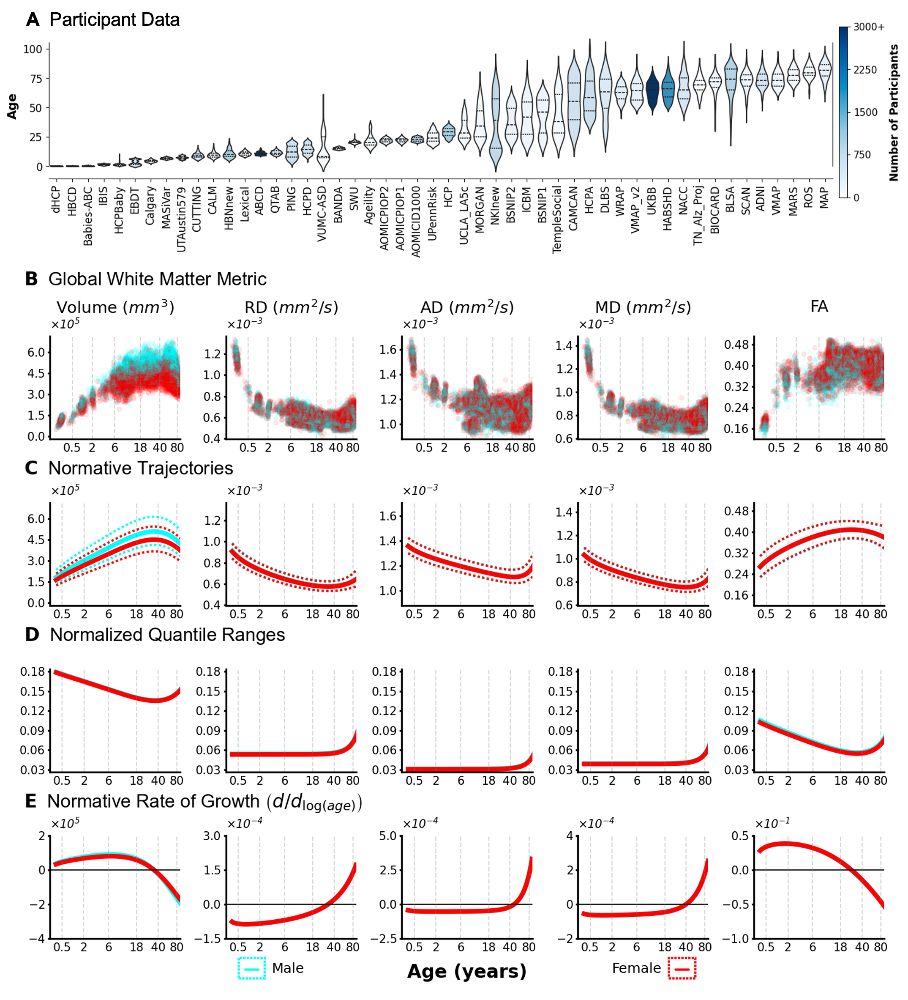

Paper: https://www.nature.com/articles/s41586-026-10454-2

Github: https://github.com/MASILab/WMLifespan
- `lifespan` contains the core code/functions for fitting, manipulating, OOS alignment, and extraction of the curves
- `scripts` contains all the scripts/python notebooks used to run analyses using the base `lifespan` code
  - `dataset_organization` contains code that was used to organize a good deal of the datasets for this project (and beyond)
    - A lot of the remaining code for organization can be found here: https://github.com/MASILab/Diff_MRI_Harmonization/tree/main/nfs2_organization_scripts
  - `Tractseg_Scripts` and `FSWMmask_scripts` has a lot of the preprocessing code for extracting features and aggregating the major CSV
  - `LifespanExtension` subdirectory contains the base code for the original Journal submission
  - `LifespanRevisions` subdirectory contains the code for the rebuttal/revisions

The Docker for the brain charts and the alignment process can be found here: https://zenodo.org/records/15367425

The post-processing Docker container documentation is here: https://zenodo.org/records/17144461
- the github repo for the container (please pull from Dockerhub, do NOT rebuild) is here: https://github.com/MASILab/WMLifespan_postprocessing_code
- the docker is here: https://hub.docker.com/r/kimm58/wm_lifespan_processing
- the preprocessing was done via PreQual: https://zenodo.org/records/18624309

Public data release (data that we got approval to release publicly): https://zenodo.org/records/18891848

Nature - We made microstructural and macrostrucutral brain charts for the Human lifespan from 0 to 100 years of age for 72 different WM tracts in the brain. We showed their utility in identifying normative population trajectories for white matter, testing neurobiological hypotheses, and performing anomaly detection. We also publicly released the charts as well as a method for out-of-sample dataset alignment on Zenodo as a docker container.

Signed: Gaurav Rudravaram, June 11 2026

## 7.) Analytic Bounds on GAMLSS Model Variability of Normative White Matter Brain Charts

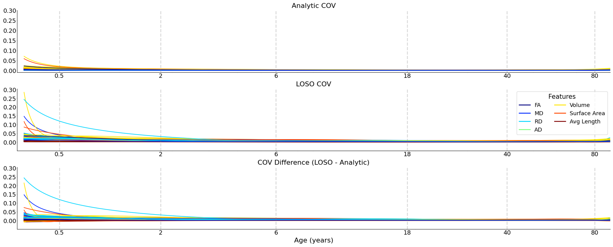

Github: https://github.com/MASILab/WMLifespan/tree/main/scripts/ModelConfidence

Paper: https://pubmed.ncbi.nlm.nih.gov/41659596/

SPIE 2026 - We characterized the analytic and empirical (LOSO bootstrapping) stability of the WM brain chart trajectories across the lifespan. We found that the charts were highly stable.

Signed: Gaurav Rudravaram, June 11 2026

## 8.) Charting Confidence in White Matter Brain Charts: Enabling Study Planniung Through Stability Validation

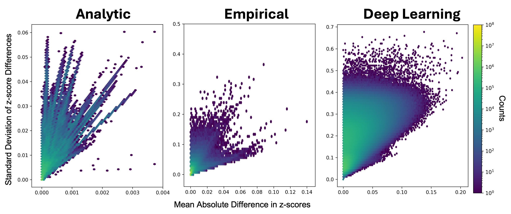

Paper submitted, not on Arxiv.

Github:
- New analytic method: https://github.com/MASILab/WMLifespan/tree/main/scripts/ModelConfidence/AnalyticWithRE
- New empirical method (95% dropout): https://github.com/MASILab/WMLifespan/tree/main/scripts/ModelConfidence/Bootstrap/95_dropout
- Deep Learning method: https://github.com/MASILab/WMLifespan/tree/main/scripts/ModelConfidence/DeepLearning

(In submission to JMI) - We assessed stability of the charts with more data (resubmission data), including stability of centile scores, while also using a deep learning approximation as a negative control. We also highlighted the importance in using model variability assessments when preparing to conduct analyses (determining sample size to capture biological effects), and facilitate doing so through use of our charts.

Signed: Gaurav Rudravaram, June 11 2026

## 9.) Enhancing Reproduciblity in Neuroimaging with Containerized Archival

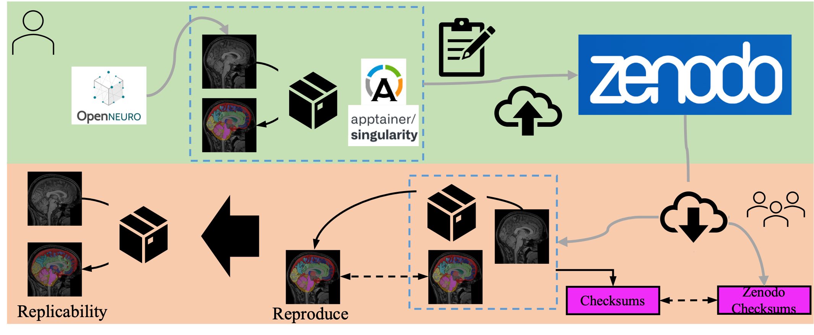

Paper submitted, not on Arxiv.

Github: https://github.com/MASILab/Informatics_ADSP/tree/main/containerization
- also these Zenodo pages:
  - https://zenodo.org/records/18624262
  - https://zenodo.org/records/18513211
  - https://zenodo.org/records/18624309

(In revisions for Brain Imaging and Behavior) - We highlight issues with containerization in the field of neuroimaging in order to preserve methodology in long tail of science. To do so, we demonstrate a method for public archival of container images to ensure reproducibility and replicability of science. We follow with a discussion of alternative strategies for archival of containers.

Signed: Gaurav Rudravaram, June 11 2026

## 10.) Independent contributions of Alzheimer's Disease and White Matter Polygenic Risk to White Matter Brain Chart Features

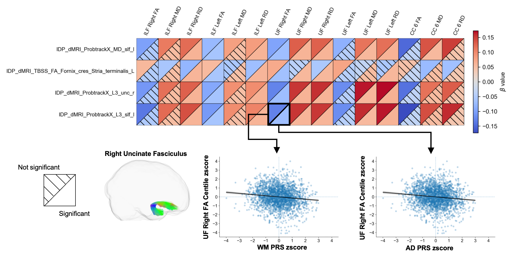

Github: https://github.com/MASILab/WM_genetics

(Plannning to submit to Alz. and Dementia) - A paper testing the hypothesis that the genetic architecture of Alzheimer's diease and white matter both independently and significantly contribute to variaiblity in white matter centile scores. We found this to be true for microstructural measures of a few specific tracts that are known to have associations with Alzheimer's.

## 11.) QA Paper with Yihao (Yihao is corresponding author)

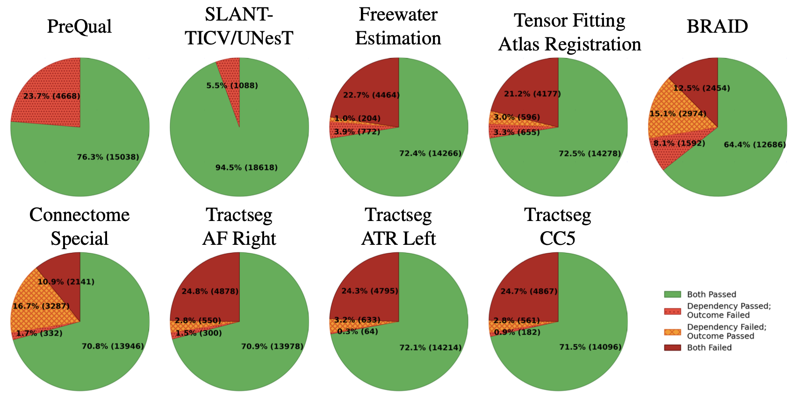

Paper submitted, not on Arxiv.

Github: https://github.com/MASILab/Diff_MRI_Harmonization/tree/main/nfs2_organization_scripts/Yihao_QA

(Submitted to JMI) - Characterization and how-to for QC of interdependent dMRI data processing pipelines.

Signed: Gaurav Rudravaram, June 11 2026

## 12.) Slice Permutation of Medical Imaging Data Based on Body Part Regression (working title)

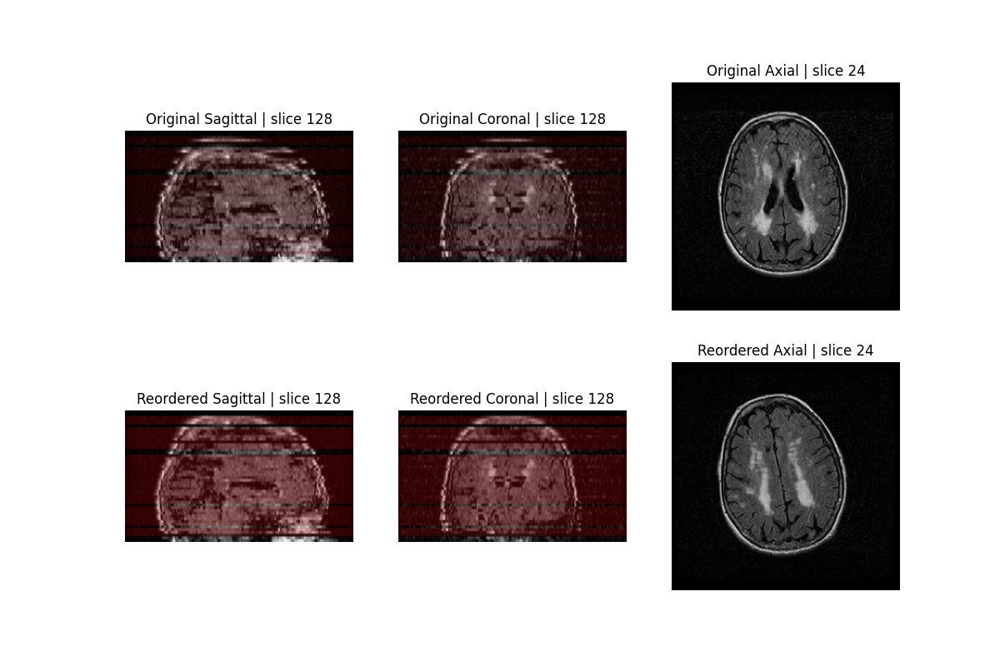

Github: https://github.com/MASILab/slice_permutation_BPR

(WIP - will try to submit to SPIE 2027) - A proposed method for detecting when slices in medical images are misordered and then properly aligning them, with the idea that the tool can be used as a QC sanity check for clinical images. Preliminary results are promising, but we will have to see.

## EXTRA: Thalamus Connectivity Collaboration with Dr. Englot's group

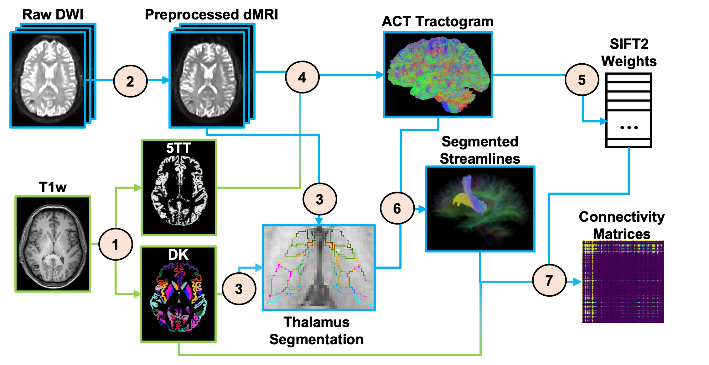

Github: https://github.com/MASILab/WM_genetics/tree/main/scripts/test/thalamus

I built a thalamus connectivity pipeline for the Englot group, which has the following steps: 1) T1+DTI segmentation of thalamus sub-nuclei using probabilistic segmentation algorithm from FreeSurfer, 2) ACT whole brain tractography (10 mill streamlines) with SIFT2 streamline weighting, where the FODs are normalized with MRtrix, 3) Extraction of streamlines that pass through subthalamic nuclei, and 4) SIFT2-weighted connectivity of the thalamic subnuclei to regions of the DK and SLANT atlases.

This is currently a part of the MASI snakemake workflow.

Signed: Gaurav Rudravaram, June 11 2026
## EXTRA: ADSP/R01 Diffusion Data Organization

Github: https://github.com/MASILab/Diff_MRI_Harmonization.git (and R01_Data_Organization)

Organized and preprocessed the majority of the datasets for the ADSP/R01 grants. Created a script generator that allows for easy and standardized preprocessing of data on ACCRE (or locally as well), given that data is in BIDS format. Also created a few query tools that do various tasks, such as summarize the preprocessing that has been run, number of shells, etc.

Signed: Gaurav Rudravaram, June 11 2026
## EXTRA: Auto QA of ADSP Processing Pipelines (script generator included)

Github: https://github.com/MASILab/ADSP_AutoQA.git

Code for automated QA of processing pipelines in the ADSP/R01 project. There are 4 ideas/problems that this tool is trying to address: 1.) Promote consistency of data QA, so that everyone on the team is performing QA in the same way. 2.) Facilitates aggregation of QA results across pipelines and datasets, as changes are automatically pushed to a CSV file that indicates the QA status. Not only does this reduce the manual effort in keeping track of the QA status of processing, but makes it easier to share QA results within lab and with collaborators who use the data. 3.) Gives us a structured organization for the QA of our pipelines/datasets, so that we can easily combine the QA results of multiple pipelines/datasets together. Finally, 4.) it provides a nice graphical user interface for reporting the QA status.

Signed: Gaurav Rudravaram, June 11 2026
## EXTRA: Atlas Registration from T1 space to Diffusion Space

Github: https://github.com/MASILab/AtlasToDiffusionReg

Created a singularity for deformably registering an atlas to a diffusion scan of a subject using ANTs, fsl, c3d, etc. Requires a T1, a segmentation of the T1 (SLANT preferrably), the preprocessed DWI scan, the structural template and the labelmap/atals, and label files for both the segmentation and the labelmap/atlas. Outputs the transformations and registered atlas, as well as a CSV of the mean, median, and stdev of the tensor metrics for FA, MD, AD, RD.

Signed: Gaurav Rudravaram, June 11 2026
